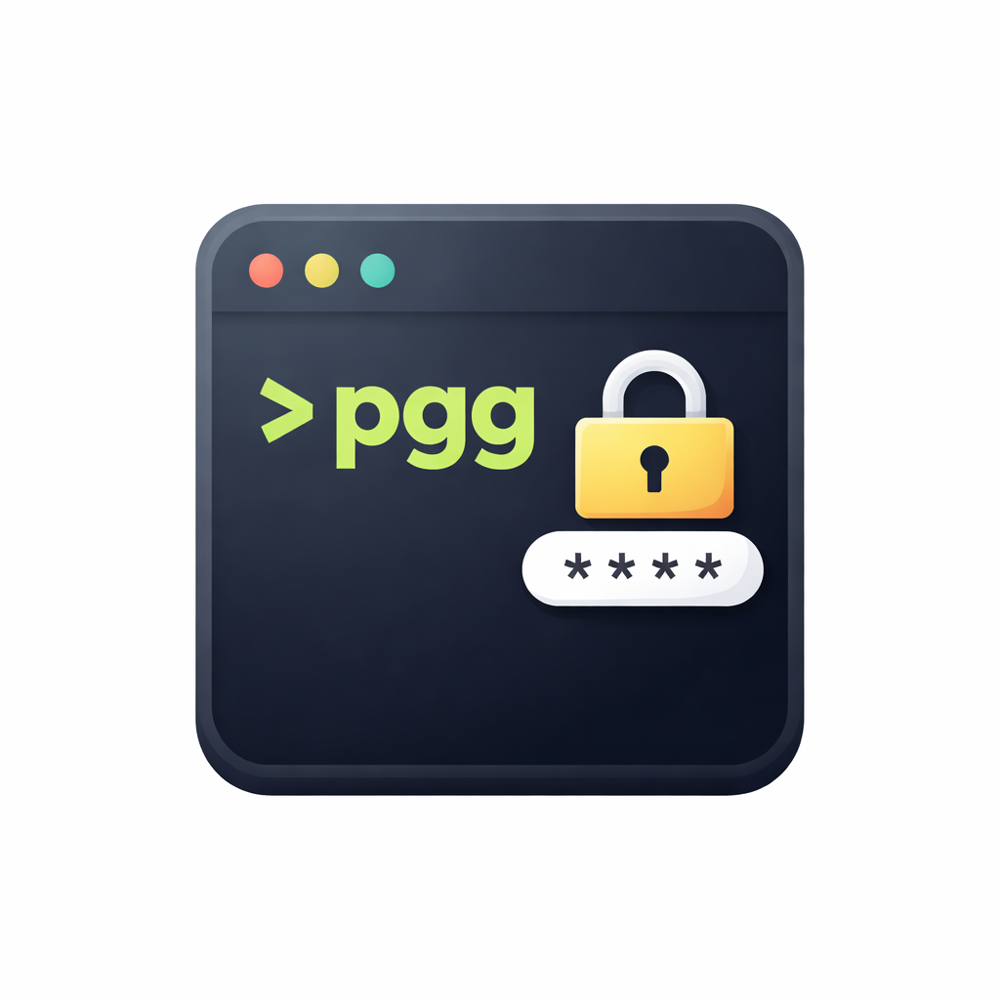

# pgg — Password Generator in Golang



**pgg** is a secure, terminal-based password generator written in **Go**, built on top of `crypto/rand`.  
It allows you to generate strong passwords, save them locally, copy them to the clipboard, and manage them directly from the command line.

This project is designed as a lightweight and secure alternative to GUI-based password managers, focused on developer workflows.

---

## Features

- Cryptographically secure password generation using `crypto/rand`
- Configurable password length and character sets
- Save generated passwords with a service identifier
- Copy passwords to clipboard
- List, delete, and export saved passwords
- Built using Cobra for a clean CLI experience

---

## Installation

### Using Go


go install github.com/leonibeldev/pgg-cli@latest


### Build from source

```bash
git clone https://github.com/leonibeldev/pgg-cli.git
cd pgg-cli
go build -o pgg-cli main.go
```

---

## Usage

Generate a password with a custom length and character types:

```bash
pgg-cli --length 10 --types lower,numbers,special --save facebook.com
```

Example output:

```bash
Password 4sd56456sa3?w2
```

---

## Flags

### Password Generation

| Flag       | Alias | Description                       | Default                       |
| ---------- | ----- | --------------------------------- | ----------------------------- |
| `--length` | `-l`  | Length of the password            | `16`                          |
| `--types`  | `-t`  | Character types to include        | `numbers,upper,lower,special` |
| `--save`   | `-s`  | Save password with a service name | `""`                          |
| `--copy`   | `-c`  | Copy password to clipboard        | `false`                       |
| `--delete` | `-d`  | Delete password by ID             | `0`                           |
| `--export` | `-e`  | Export passwords to a JSON file   | `false`                       |
| `--list`   | `-g`  | List all saved passwords          | `false`                       |

---

### Character Types

| Code | Description        |
| ---- | ------------------ |
| `lower`  | Lowercase letters  |
| `upper`  | Uppercase letters  |
| `numbers`  | Numbers (0–9)      |
| `special`  | Special characters |

Example:

```bash
pgg-cli --length 12 --types lower,numbers
```

---

## Password Management

### List Saved Passwords

```bash
pgg-cli --list
```

Output example:

```text
-----------------------------------------------
|   ID   |     Service     |      Password    |
|---------------------------------------------|
|  5132  |  facebook.com  |  4sd56456sa3?w2   |
-----------------------------------------------
```

---

### Delete a Password

```bash
pgg-cli --delete 5132
```

Confirmation:

```text
Are you sure you want to delete password with ID 5132? [y/N]: 
```

---

### Export Passwords

Export all stored passwords to a JSON file in the actual directory:

```bash
pgg-cli --export
```

Example output file:

```json
[
  {
    "ID": 5132,
    "Service": "facebook.com",
    "Password": "fd538245d2z105104:'s",
    "Username": "user123",
    "Created_at": "10/10/10"
  }
]
```

---

## Version

```bash
pgg-cli --version
```

---

## Project Structure

* `cmd/` – CLI commands and flags
* `crypt/` – Secure password generation logic
* `flags/` – Flag parsing and validation
* `utils/` – Persistence and helper utilities

---

## Security Notes

* Passwords are generated using `crypto/rand`, not `math/rand`
* No passwords are sent over the network
* Local storage responsibility belongs to the user

---

## Roadmap

* Encrypted local storage
* Clipboard auto-clear timeout
* Config file support
* Cross-platform clipboard improvements

---

## License
MIT License © 2026 LeonibelDev
